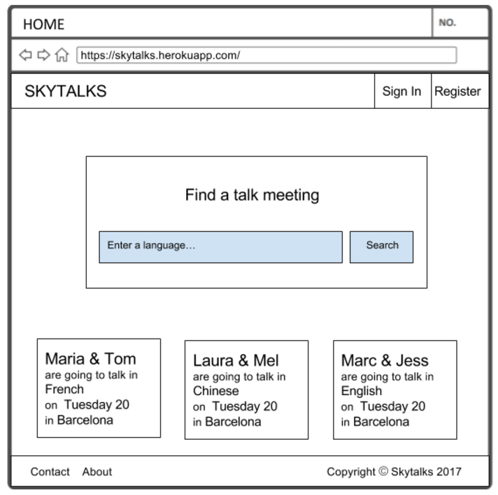
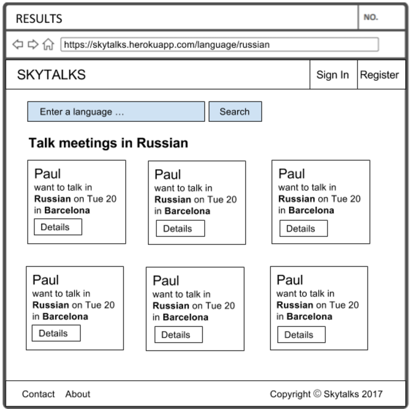
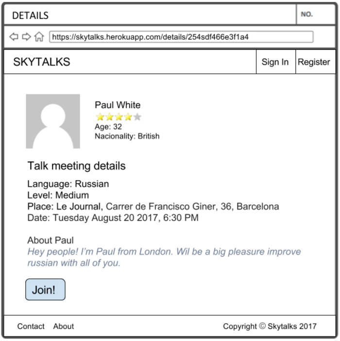
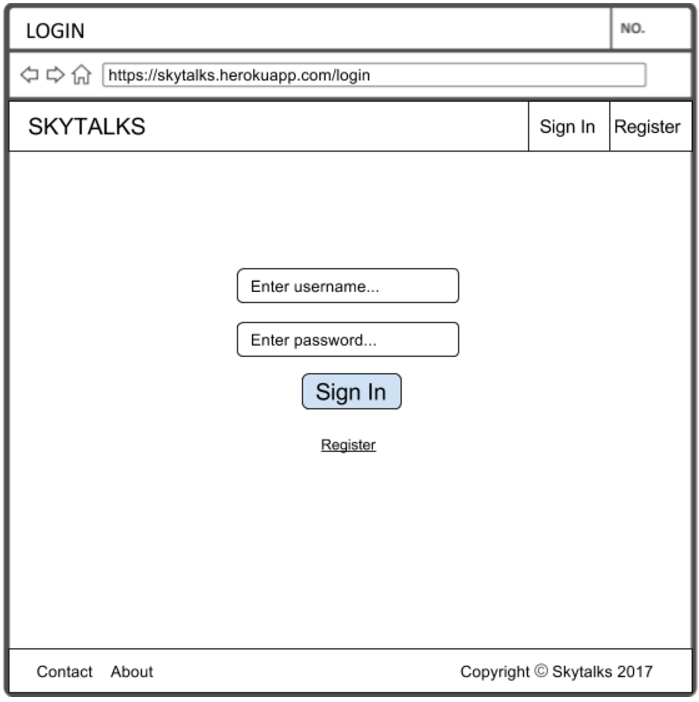
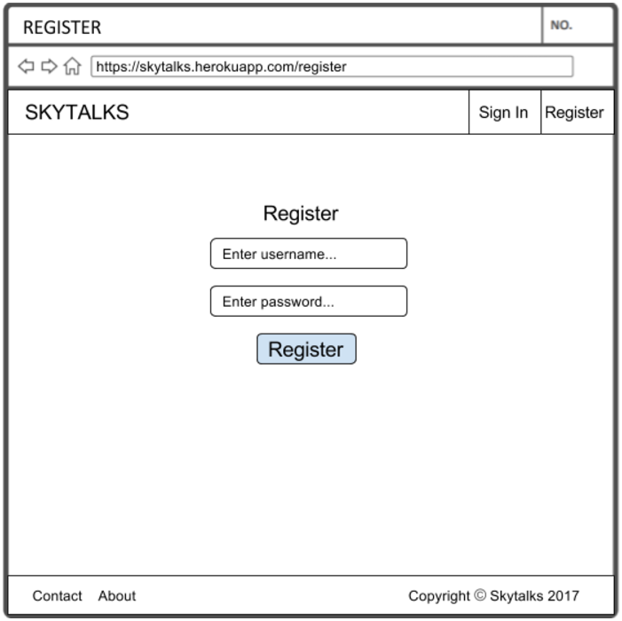
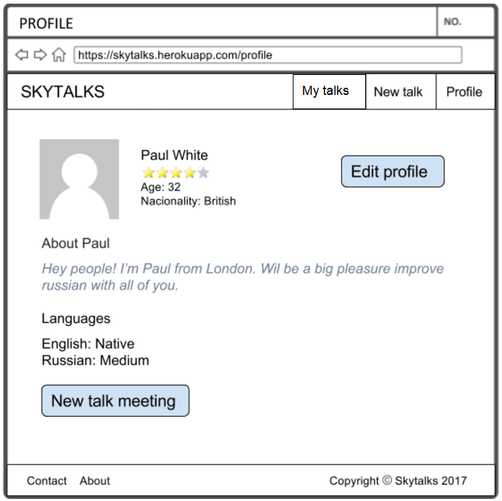
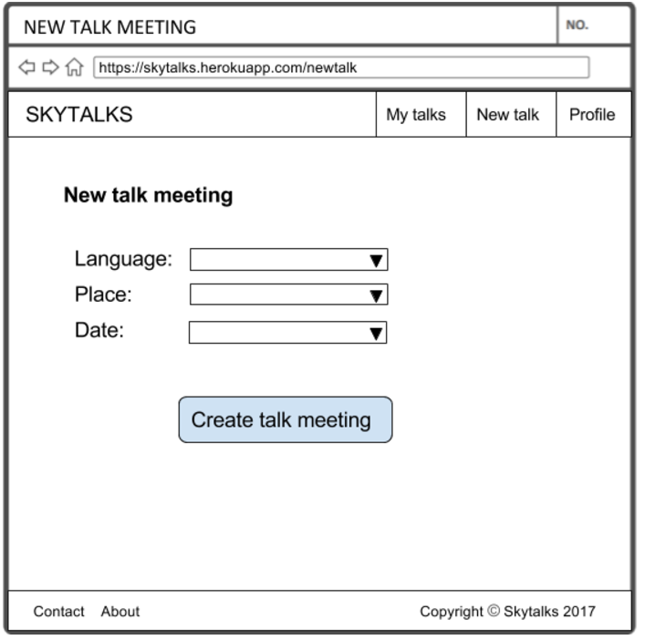
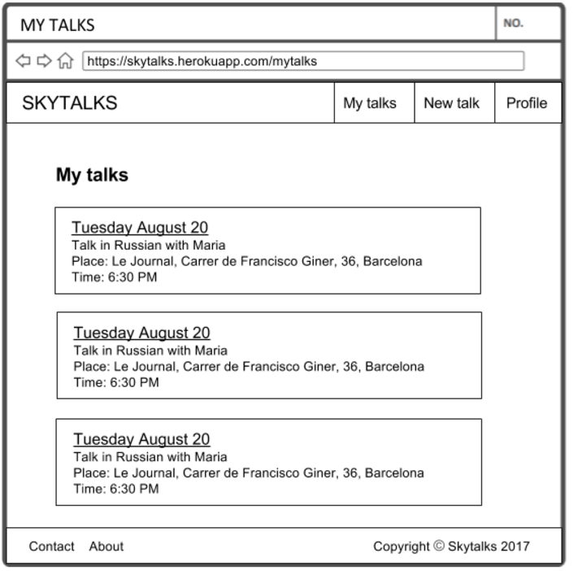
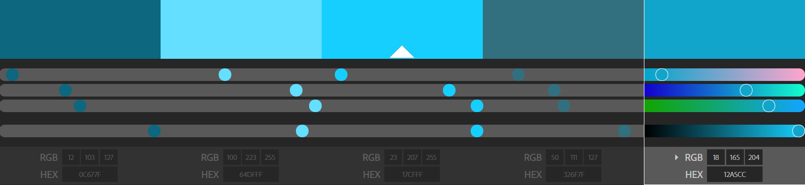

# SKYTALKS

## [PROJECT IN PROGRESS]

[PROJECT IN PROGRESS]:https://skytalks.herokuapp.com/#!/

**Descripción**

Skytalks es una aplicación web enfocada a realizar intercanvio de idiomas entre usuarios.

Permitirá al usuario, mediante un sistema de registro y logueo, acceder a su perfil en el que podrá detallar los idiomas que quiere prácticar y el nivel que tiene de cada idioma. A la vez le permitirá crear encuentros para prácticar un idioma al que otros usuarios podrán apuntarse. Desde la página de inicio se podrán realizar busquedas por idioma para apuntarse a intercanvios que hayan anunciado otros usuarios.

**Páginas**

* Home

Al acceder a la página principal de skytalks nos encontraremos con un buscador para poder introducir el idioma que queremos practicar. En la misma página podremos ver un resumen de algunos de los encuentros que ya esten confirmados entre dos o más usuarios.

* Results

En la página de resultados, después de introducir un idioma en el buscador, se listarán los encuentros creados por otros usuarios para conversar en el idioma buscado

* Details

En la página de detalles, después de seleccionar algun encuentro, se mostraran los detalles del usuario e idioma, fecha, hora y lugar del encuentro

* Login

En la página de login podremos introducir nuestro usuario y contraseña para acceder con nuestros datos. En la parte inferior habrá un link para registrarse en caso de ser un nuevo usuario. A la página de login se podrá acceder en cualquier momento desde la barra de navegación que se encontrará en la cabecera o en caso de querer apuntarse a un encuentro de otro usuario sin estar logueado.

* Register

En la página de registro podremos darnos de alta como nuevos usuarios introduciendo un nombre de usuario y una contraseña. A la página de registro se podrá acceder en cualquier momento desde la barra de navegación que se encontrará en la cabecera o desde la página de login.

* Profile

En la página de perfil podremos ver y editar nuestros datos. También tendremos un boton para crear un nuevo encuentro para intercambiar idiomas.

* New talk

En la página crear nueva conversación podremos crear un encuentro seleccionando el idioma, lugar y fecha para realizarlo. Por defecto ese nuevo encuentro cogerá el nivel que tengamos asociado a ese idioma en nuestro perfil y los datos del usuario que lo ha creado.

* My talks

En la página "mis conversaciones" podemos consultar las próximas conversaciones que ya tenemos confirmadas con otros usuarios.

**Colors**

**Font family**

* Raleway

~~~
<link href="https://fonts.googleapis.com/css?family=Raleway" rel="stylesheet">
~~~

font-family: 'Raleway', sans-serif;

